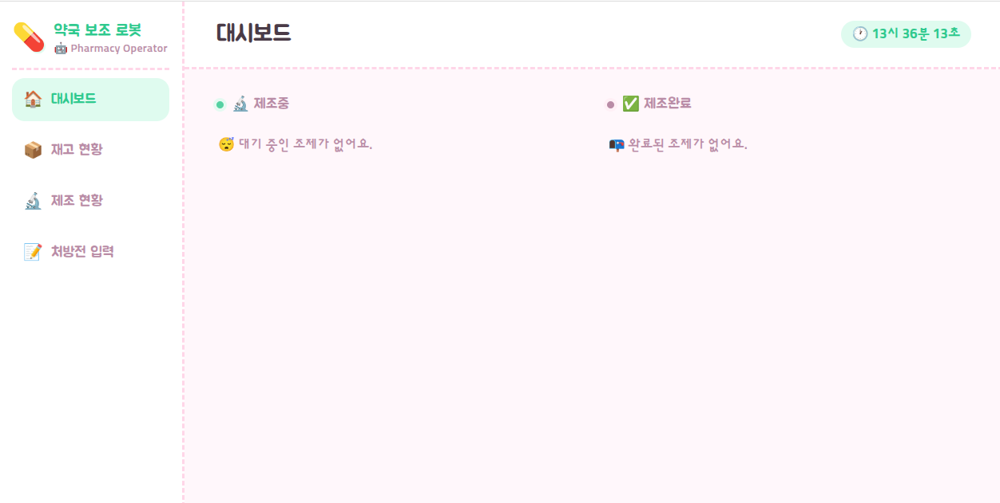
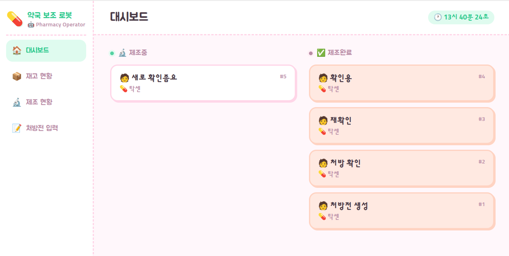
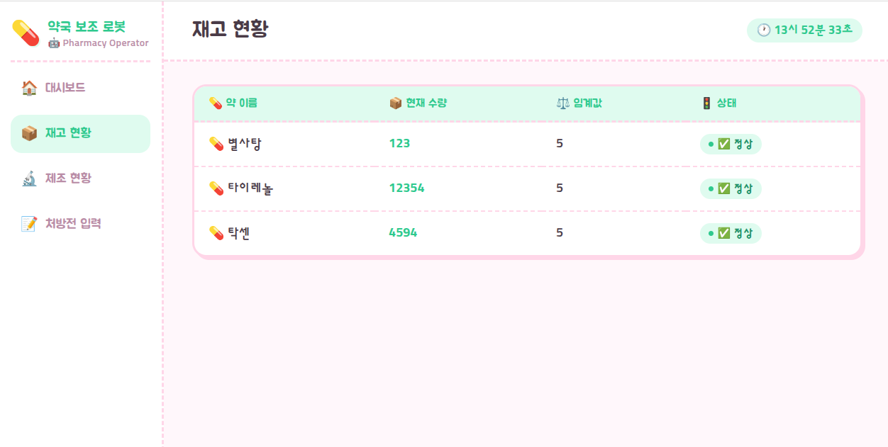
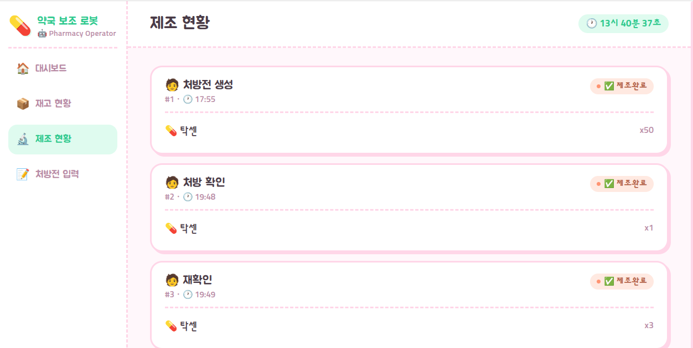
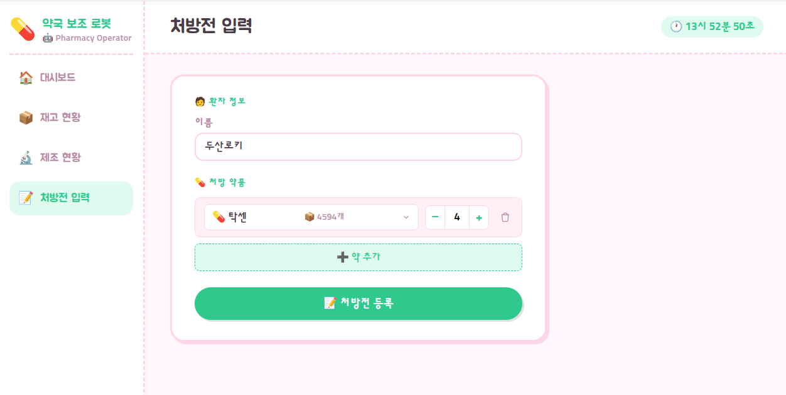
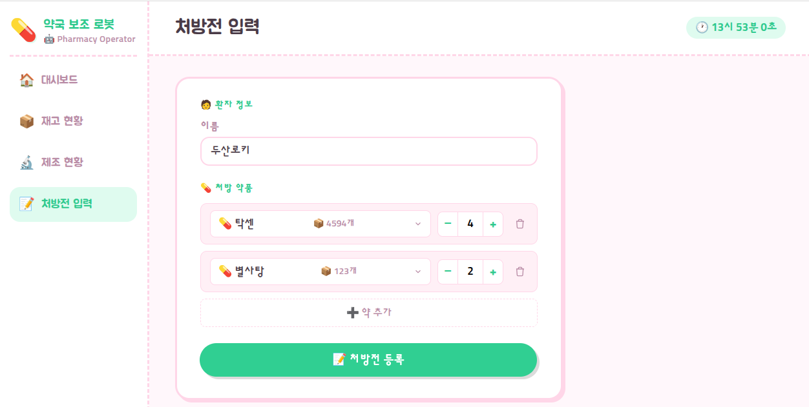

## 6. 🖼️ UI 화면 구성도 (UI Screens)

약사가 사용하는 웹 대시보드로, Flask 기반 4페이지 + 사이드바 네비게이션으로 구성했습니다.

### 6-1. 공통 요소 - 사이드바

  

| 메뉴 | 이동 페이지 |
|---|---|
| 🏠 대시보드 | 제조중/제조완료 처방전 현황 |
| 📦 재고 현황 | 약품별 재고 테이블 |
| 🔬 제조 현황 | 처방전별 상세 진행 상태 |
| 📝 처방전 입력 | 새 처방전 등록 |

우측 상단 시계는 현재 시각을 실시간으로 표시합니다.

---

### 6-2. 대시보드 (`/dashboard`)

  

* *제조중인 처방전과 제조완료된 처방전을 두 컬럼으로 나눠서 실시간으로 보여주는 메인 화면입니다.*
* 🧑 환자 이름, 처방전 번호(`#5`), 💊 약 이름이 카드 형태로 표시됩니다.
* 별도 버튼 없이, 로봇 상태가 바뀌면 카드가 **제조중 → 제조완료 컬럼으로 자동 이동**합니다.
* 처리할 처방전이 없을 때는 "🤔 대기 중인 조제가 없어요" / "📭 완료된 조제가 없어요" 안내 문구가 표시됩니다.

---

### 6-3. 재고 현황 (`/inventory`)

  

* *약품별 현재 재고 수량과 상태를 테이블로 확인하는 화면입니다.*

| 컬럼 | 내용 |
|---|---|
| 💊 약 이름 | 약품명 |
| 📦 현재 수량 | 적재소 기준 재고 수량 |
| ⚖️ 임계값 | 재고부족 판단 기준값 (공통 5개) |
| 🚦 상태 | 정상 / 곧 부족 자동 판정 |

---

### 6-4. 제조 현황 (`/production`)

  

* *처방전별로 카드가 나뉘어, 처방번호·등록시각·처방 약품과 수량, 진행 상태를 확인할 수 있는 화면입니다.*
* 상태 배지: **🔬 제조중** / **✅ 제조완료**
* **[🔍 검수완료] 버튼**: 제조중인 처방전 카드에만 노출되며, 클릭 시 확인 팝업 → 확인 시 DB에 완료 처리 요청 + 로봇에 붓기 시작 신호 전달

---

### 6-5. 처방전 입력 (`/prescription`)

  
  

* *왼쪽: 약 1개 입력 상태 / 오른쪽: [약 추가] 버튼으로 두 번째 약 행을 추가한 상태*

| 버튼/구성 | 기능 |
|---|---|
| 이름 입력란 | 환자 이름 입력 (예: `두산로키`) |
| 약 선택 드롭다운 | 재고 있는 약 목록에서 검색·선택. 옆에 현재 재고량(`4594개`) 표시. 이미 다른 행에서 선택한 약은 목록에서 제외 |
| **`−` / `+` 수량 스테퍼** | 처방 수량 조절 (1~50개) |
| 🗑️ 휴지통 아이콘 | 해당 약 행 삭제 |
| **[+ 약 추가] 버튼** | 새로운 약 입력 행 추가. 등록 가능한 약을 모두 추가하면 자동 비활성화 |
| **[📝 처방전 등록] 버튼** | 재고 확인 후 DB에 처방전 생성 요청. 재고 부족 시 알림 표시 |